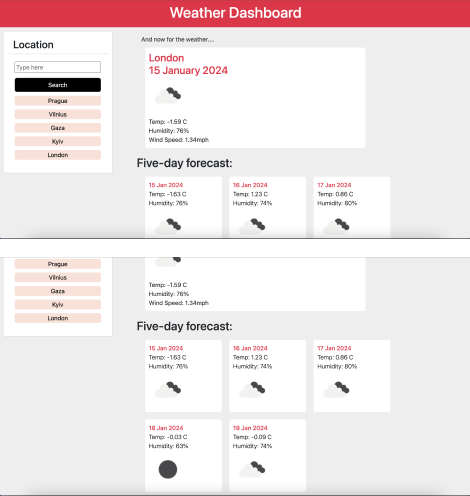

# Weather-or-not. 
A weather dashboard (in progress)

An app for travelers who want to see the weather outlook for multiple cities so that they can plan a trip accordingly.

## Description

This is a weather dashboard that will run in the browser and feature dynamically updated HTML and CSS.
When a user searches for a city they are presented with current and future conditions for that city.

## Usage
 When a user views the current weather conditions for that city they are presented with the city name, the date, an icon representation of weather conditions, the temperature, the humidity, the wind speed.

 When a user views future weather conditions for that city they are presented with a 5-day forecast that displays the date, an icon representation of weather conditions, the temperature, the humidity, the wind speed.
  
## Deployment

[Link to the deployed application]
(https://codeswitchstudio.github.io/weather-or-not/)

## Screenshots

## Credits

Huge thanks to our pod 3 TA Kimberly Rodriguez.

[Open Weather API]
(https://openweathermap.org/)

[Coding Nepal]
(https://www.codingnepalweb.com/weather-app-project-html-javascript)

[Code Sandbox]
(https://codesandbox.io/p/sandbox/weather-dashboard-sfsxry)

[Chat GPT]
(https://chat.openai.com/)

## License

MIT License

Permission is hereby granted, free of charge, to any person obtaining a copy
of this software and associated documentation files (the "Software"), to deal
in the Software without restriction, including without limitation the rights
to use, copy, modify, merge, publish, distribute, sublicense, and/or sell
copies of the Software, and to permit persons to whom the Software is
furnished to do so, subject to the following conditions:

The above copyright notice and this permission notice shall be included in all
copies or substantial portions of the Software.

THE SOFTWARE IS PROVIDED "AS IS", WITHOUT WARRANTY OF ANY KIND, EXPRESS OR
IMPLIED, INCLUDING BUT NOT LIMITED TO THE WARRANTIES OF MERCHANTABILITY,
FITNESS FOR A PARTICULAR PURPOSE AND NONINFRINGEMENT. IN NO EVENT SHALL THE
AUTHORS OR COPYRIGHT HOLDERS BE LIABLE FOR ANY CLAIM, DAMAGES OR OTHER
LIABILITY, WHETHER IN AN ACTION OF CONTRACT, TORT OR OTHERWISE, ARISING FROM,
OUT OF OR IN CONNECTION WITH THE SOFTWARE OR THE USE OR OTHER DEALINGS IN THE
SOFTWARE.
